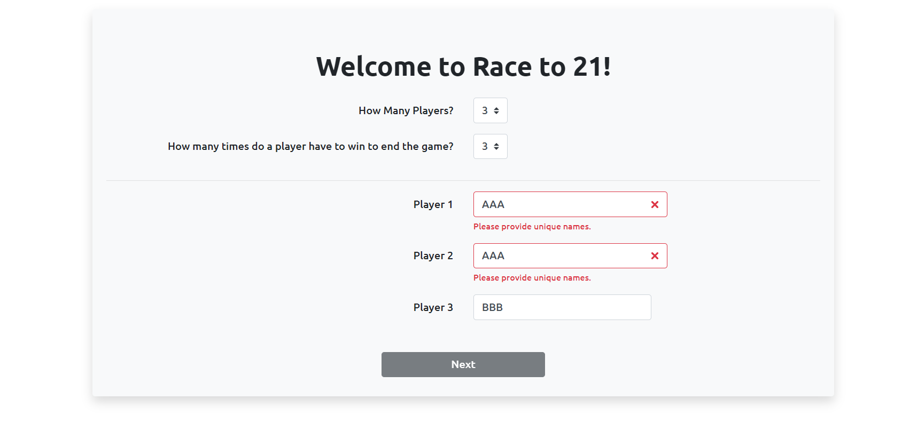
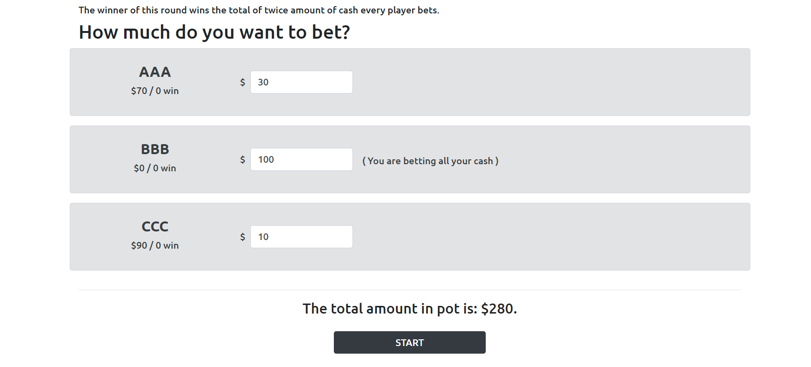
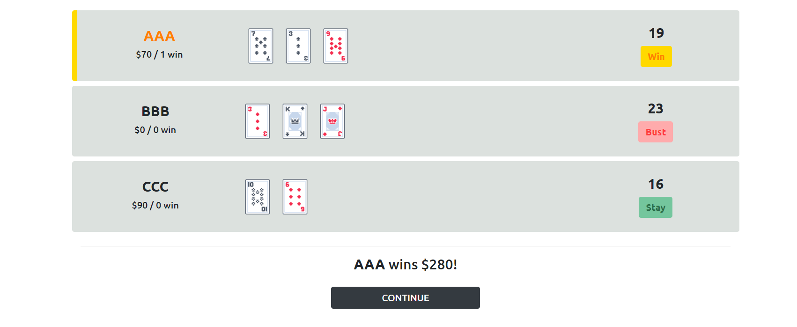
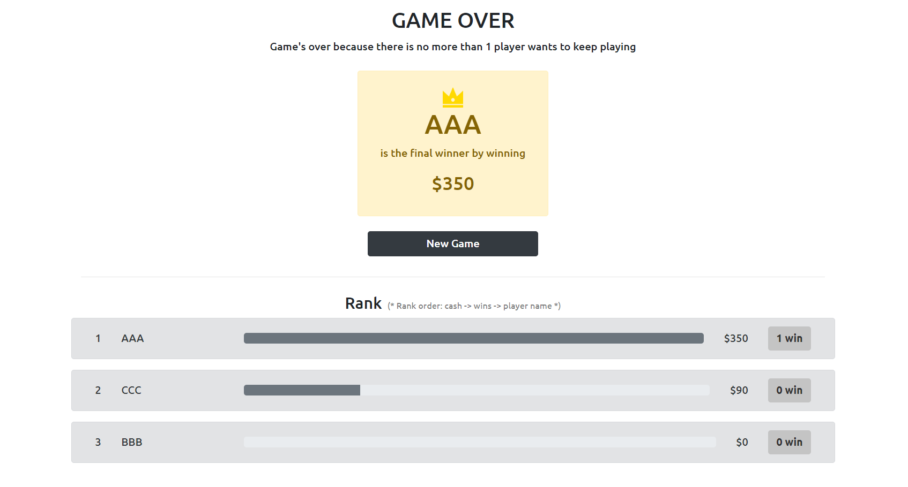

# Race to 21 Blazor version
A poker game that's similar to black jack.

This is a blazor version of the Race to 21 project I created previously. [(See Project)](https://github.com/KevinSu-yc/RaceTo21_Game_Improvement)

## Page flow

## Ask Player Info Page

* Select number of player (number of inputs will change accordingly)
* Select number of rounds to wi
* Enter player names
* Click NEXT button to go to Ask Bet Page 

 

* Highlight the names that are not unique

 

* Enabled the Next button when all names are entered and unique
* Show message about the conditions that end the game

 

## Ask Bet Page

* Enter all amount of bet, from 1 to all money the player has. (the money under player name + the entered money = all money the player has)
* Highlight the invalid bets
* The pot is twice of every players bet (the numbers changes immediately when the entered value changes)
* Click START button to go to Game Playing page

 

* Enable the START button when all entered money are valid

 

## Game Playing page

* Highlight the on-turn player's row
* Choose Deal or Stay on the player's turn
* Go to Announce Round Winner page immediately when a winner appears in a round

 

## Announce Round Winner page

* Highlight the winner’s row and announce how much the winner wins
* Click CONTINUE button to go to Check New Round Page (Go to Game Over page if someone wins enough rounds or only one player still has cash)

 

## Check New Round Page

* Select whether to keep playing for each player
* Click Next button to go back to Ask Bet page
    * (Remove players who don't want to keep playing or have no cash)
    * (If meet the end game condition, go to Gave Over page instead)

 

## Extreme Case Layout

* 6 players and some players get more than 3 cards
    * The player containers are resized when there are more than 3 players so a row can contain 2 players
    * When a player gets more than 3 cards, the cards start to stack

(The containers resize on Ask Bet page, Game Playing page, Announce Round Winner page, and Check New Round page)

 

## Game Over Page

* Show the reason that ends the game
* Announce the final winner and how much they win
* Show the rank of every player even if they quit at the middle of the game
    * (rank order: cash > wins > player name)
    * Use percentage bars to visualize the difference among all the players' money
* Click New Game button to go to back to Ask Player Info page to start a new game